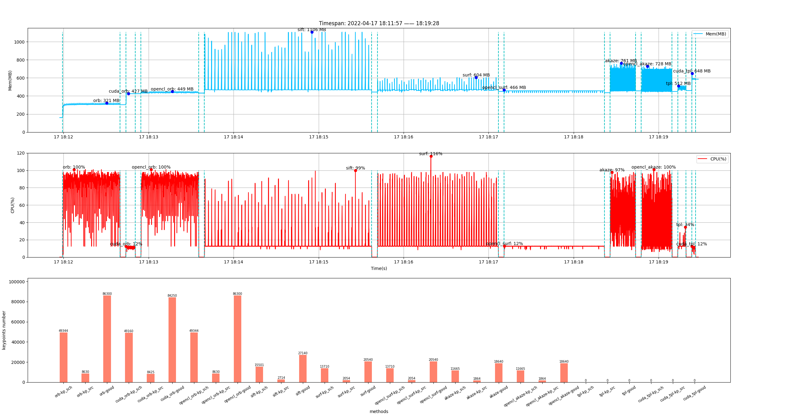
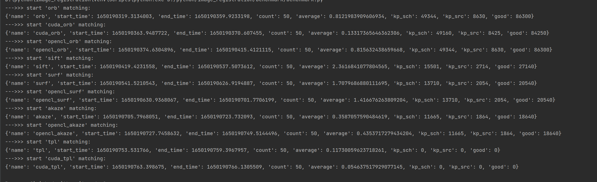

# 1）前言
从18年开始,我接触了叉叉助手(已经被请喝茶了),用来给常玩的游戏写挂机脚本,写了也有两三年.也算是我转行当游戏测试的理由.<br />
去年11月,也是用了这身技术,混进了外包,薪资还不错,属于是混日子了,岗位是在发行,接触到很多游戏,因为接不了poco,到手只有apk,
日积月累,游戏越来越多,项目组却还是只有这点人.为了减轻自己的压力,就开始了UI自动化的不归路.<br />

# 2）游戏UI自动化
因为游戏引擎,是无法通过appium等框架去获取,如果不接入一些SDK,那么识别的方法只有图像识别.现在常见的开源框架
1. 网易的Airtest,通过传统识别进行自动化,还有airtestIDE可以简单快速的编写airtest代码
2. 腾讯GameAISDK,通过深度学习进行自动化(没用过,好久不维护了)
3. 阿里的SoloPi,主要功能是录制、群控,有图像匹配辅助

UI自动化的核心在于查找元素,并且在什么位置.那么重点就会放在图像识别上.<br />
在社区里、qq的测试群里就能发现,大多数人对图像识别的印象是:慢,不准.<br />
今年过年前,去张江面试过一家游戏公司,也是发行公司,聊了一个多小时,聊下来他们的方案是airtest一种机型截一个图去做适配.我大受震撼.<br />
总结下来图像识别的UI自动化难点:
1. 识别慢
2. 识别结果不准确
3. 多分辨率不兼容性
4. 游戏UI更新,管理图片库的成本


# 3）怎么解决
先发我的答案:https://github.com/hakaboom/py_image_registration <br />
目前也是在重构,重构完成后可能起个好名字:https://github.com/hakaboom/image_registration

一开始是参考了airtest的aircv部分,当时不想有那么多依赖,就拆出来了.
重构之后,通过对opencv一些api的封装,重新组织了构架和算法.目前效果感觉不错,也已经给airtest提了pr,期待能够合并


## 什么是特征点
简单的理解: 用于描述图像特征的关键点

常见的特征点提取算法:
1. SIFT: 尺度不变特征变换. opencv只有cpu实现
2. SURF: surf的加速算法. opencv有cpu和cuda实现
3. ORB: 使用FAST特征检测和BRIEF特征描述子. opencv有cpu和cuda实现

他们的好处是什么: 尺度和旋转不变性,说白了就是兼容不同分辨率、旋转、尺度的变换

速度排序: ORB(cuda)>SURF(cuda)>ORB>SURF>SIFT

效果排序(没做过测试,算是经验): SIFT>ORB>SURF

## 例子

- 6.png(2532x1170)iphone12pro上的截图
- 4.png(1922x1118 实际游戏渲染是1920x1080,多出来的是windows边框)崩三桌面端的截图, 裁剪了右上角的蓝色加号区域当模板
```python
import cv2
import time
from baseImage import Image, Rect
from image_registration.matching import SIFT

match = SIFT()
im_source = Image('tests/image/6.png')
im_search = Image('tests/image/4.png').crop(Rect(1498,68,50,56))

start = time.time()
result = match.find_all_results(im_source, im_search)
print(time.time() - start)
print(result)
img = im_source.clone()
for _ in result:
    img.rectangle(rect=_['rect'], color=(0, 0, 255), thickness=3)
img.imshow('ret')
cv2.waitKey(0)
```
结果可以得到三个加号的位置
```
[
    {'rect': <Rect [Point(1972.0, 33.0), Size[56.0, 58.0]], 'confidence': 0.9045119285583496}, 
    {'rect': <Rect [Point(2331.0, 29.0), Size[52.0, 66.0]], 'confidence': 0.9046278297901154}, 
    {'rect': <Rect [Point(1617.0, 30.0), Size[51.0, 64.0]], 'confidence': 0.9304171204566956}
]
```


## 怎么进行匹配
airtest的特征点匹配不好使,那么我做了什么改动,我把步骤一个个拆分


1. 读取图片
```python
from baseImage import Image
im_source = Image('tests/image/6.png')
```
这边用到了我另外一个库 https://github.com/hakaboom/base_image
主要的用处对opencv的图像数据进行格式和类型的转换,以及一些接口的包装

- 使用place参数,修改数据格式
  - Ndarray: 格式为numpy.ndarray格式
  - Mat: 和numpy基本一致
  - Umat: python的绑定不多,没有ndarray灵活,可以用于opencl加速
  - GpuMat: opencv的cuda格式,需要注意显存消耗

```python
from baseImage import Image
from baseImage.constant import Place
    
Image(data='tests/image/0.png', place=Place.Ndarray)  # 使用numpy
Image(data='tests/image/0.png', place=Place.Mat)  # 使用Mat
Image(data='tests/image/0.png', place=Place.UMat)  # 使用Umat
Image(data='tests/image/0.png', place=Place.GpuMat)  # 使用cuda
```

2. 创建特征点检测类
这边会有一些参数,除了threshold(过滤阈值)、rgb(是否通过rgb通道检测)以为,还有可以加入特征点提取器的一些配置,一般默认就好,具体可以查opencv文档
```python
from image_registration.matching import SIFT

match = SIFT(threshold=0.8, rgb=True, nfeatures=50000)
```

3. 识别
```python
from image_registration.matching import SIFT
from baseImage import Image, Rect


im_source = Image('tests/image/6.png')
im_search = Image('tests/image/4.png').crop(Rect(1498,68,50,56))

match = SIFT(threshold=0.8, rgb=True, nfeatures=50000)
result = match.find_all_results(im_source, im_search)
```

4. 解析下```find_all_results```里做了什么
可以在```image_registration.matching.keypoint.base```里找到基类
    - 第一步: 创建特征点提取器```BaseKeypoint.create_matcher```<br />
    例：```image_registration.matching.keypoint.sift```
    ```python
    def create_detector(self, **kwargs) -> cv2.SIFT:
        nfeatures = kwargs.get('nfeatures', 0)
        nOctaveLayers = kwargs.get('nOctaveLayers', 3)
        contrastThreshold = kwargs.get('contrastThreshold', 0.04)
        edgeThreshold = kwargs.get('edgeThreshold', 10)
        sigma = kwargs.get('sigma', 1.6)
    
        detector = cv2.SIFT_create(nfeatures=nfeatures, nOctaveLayers=nOctaveLayers, contrastThreshold=contrastThreshold,
                                   edgeThreshold=edgeThreshold, sigma=sigma)
        return detector
    ```
    - 第二步: 特征点匹配器```BaseKeypoint.create_detector```用于匹配模板和目标图片的特征点<br />
    有两种匹配器,
      - ```BFMatcher```: 暴力匹配, 总是尝试所有可能的匹配
      - ```FlannBasedMatcher```: 算法更快,但是也能找到最近邻的匹配
    
    - 第三步: 提取特征点```BaseKeypoint.get_keypoint_and_descriptor```<br />
    用第一步创建的提取器去获取特征点.ORB这种,还需要额外的去增加描述器.具体就看代码实现吧.
    - 第四步: 匹配特征点
    用第二步创建的匹配器,获取特征点集
    - 第五步: 筛选特征点```BaseKeypoint.filter_good_point```<br />
      - ```cv2.DMatch``` opencv的匹配关键点描述符类
        - ```distance```: 两个描述符之间的距离(欧氏距离等),越小表明匹配度越高
        - ```imgIdx```: 训练图像索引
        - ```queryIdx```: 查询描述符索引(对应模板图像)
        - ```trainIdx```: 训练描述符索引(对应目标图像)
      - ```cv2.Keypoint``` opencv的特征点类
        - ```angle```: 特征点的旋转方向(0~360)
        - ```class_id```: 特征点的聚类ID
        - ```octave```:特征点在图像金字塔的层级
        - ```pt```: 特征点的坐标(x,y)
        - ```response```: 特征点的响应强度
        - ```size```: 特征点的直径大小
      
      知道了这两种类之后,我们就可以通过第四步获取的特征点集进行筛选<br />
        - 步骤1: 根据queryIdx的索引对列表进行重组,主要目的是,让一个模板的特征点只可以对应一个目标的特征点
        - 步骤2: 根据distance的升序,对特征点集进行排序,提取出第一个点,也就是当前点集中,```distance```数值最小的点,为```待匹配点A```
        - 步骤3. 获取点```待匹配点A```对应的```queryIdx```和```trainIdx```的keypoint(```query_keypoint```,```train_keypoint```,通过两个特征点的```angle```可以计算出,特征点的旋转方向
        - 步骤4. 计算```train_keypoint```与其他特征点的夹角,根据旋转不变性,我们可以根据模板上```query_keypoint```的夹角,
         去筛选```train_keypoint```的夹角
        - 步骤5. 计算以```query_keypoint```为原点,其他特征点的旋转角,还是根据旋转不变性,我们可以再去筛选以```train_keypoint```原点,其他特征的的旋转角
        - 最后,我们就可以获取到,所有匹配的点、图片旋转角度、基准点(```待匹配点A```)

5. 筛选完点集后,就可以进行匹配了,这边会有几种情况```BaseKeypoint.extract_good_points```<br />
    - 没有特征点,其实肯定会有一个特征点
    - 有1组特征点```BaseKeypoint._handle_one_good_points```
      - 根据两个特征点的```size```大小,获取尺度的变换
      - 根据步骤4中返回的旋转角度,获取变换后的矩形顶点
      - 通过透视变换,获取目标图像区域,与目标图像进行模板匹配,计算置信度
    - 有2组特征点```BaseKeypoint._handle_two_good_points```
      - 计算两组特征点的两点之间距离,获取尺度的变换
      - 根据步骤4中返回的旋转角度,获取变换后的矩形顶点
      - 通过透视变换,获取目标图像区域,与目标图像进行模板匹配,计算置信度
    - 有3组特征点```BaseKeypoint._handle_three_good_points```
      - 根据三个特征点组成的三角形面积,获取尺度的变换
      - 根据步骤4中返回的旋转角度,获取变换后的矩形顶点
      - 通过透视变换,获取目标图像区域,与目标图像进行模板匹配,计算置信度
    - 有大于等于4组特征点```BaseKeypoint._handle_many_good_points```
      - 使用单矩阵映射```BaseKeypoint._find_homography```,获取变换后的矩形顶点
      - 通过透视变换,获取目标图像区域,与目标图像进行模板匹配,计算置信度

6. 删除特征点
匹配完成后,如果识别成功,则删除目标区域的特征点,然后进入下一次循环


## 基准测试
设备环境:
- i7-9700k 3.6GHz
- NvidiaRTX 3080Ti
- cuda版本11.3
- opencv版本:4.5.5-dev(从源码编译)

从图中可以看出cuda方法的速度最快,同时cpu的占用也小,原因是这部分算力给到了cuda<br />
因为没有用代码获取cuda使用率,这边在任务管理器看的,只能说个大概数<br />
- cuda_orb: cuda占用在35%~40%左右
- cuda_tpl: cuda占用在15%~20%左右
- opencl_surf: cuda占用在13%左右
- opencl_akaze: cuda占用在10%~15%左右
- 
还有其他的算法,opencv没有提供cuda或者是opencl的实现,只能用cpu加速





## 怎么优化速度
1. airtest慢的一个原因在于,只用了cpu计算.如果能释放算力到gpu上,速度就会有成倍的增长.<br />
opencv已经给我们做好了很多接口.我们可以通过```cv2.cuda.GpuMat```, ```cv2.UMat```调用cuda和opencl的算法.<br />
通过```baseImage```可以快速的创建对应格式的图像
```python
from baseImage import Image
from baseImage.constant import Place
      
Image('tests/images/1.png', place=Place.GpuMat) 
Image('tests/images/1.png', place=Place.UMat) 
```

可以用cuda加速的识别方法
- surf
- orb
- matchTemplate

可以用opencl加速的识别方法
- surf
- orb
- matchTemplate

这边只讲了识别的方法,在其他的图像处理函数也能有一定的加速,但是不如以上方法明显

2. 从框架设计上进行加速.<br />
- 从游戏上讲,我们预先知道一些控件,在屏幕中的坐标位置.分辨率进行转换时,我们可以通过计算控件的位置,裁剪对应位置的图像,通过模板匹配进行快速的识别.
- 建立模板库,预先加载模板,得到屏幕图片后,通过一些相似度计算```baseImage.utils.ssim```对场景进行识别与分类,然后去识别相应场景的特征点.用这样的方法去减少计算量
